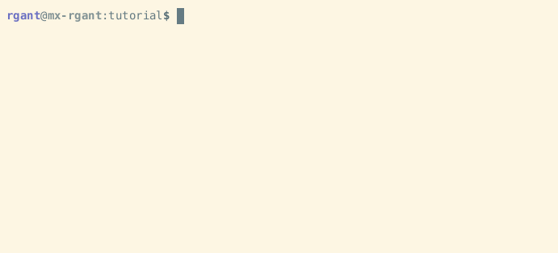

# Snagboot

Snagboot is a Python tool capable of recovering and reflashing a wide variety of
SoCs used in embedded Linux systems. It is divided into two parts: 

- **snagrecover** uses vendor-specific ROM code mechanisms to initialize
  external RAM and install U-Boot to it, without modifying any non-volatile
  memories.
- **snagflash** communicates with U-Boot to flash system images to non-volatile
  memories, using either DFU, UMS or fastboot.



Currently supported SoC families: STM32MP1, SAMA5, i.MX6/7/8, AM335, SUNXI, 
AM62x. Please check [supported_socs.yaml](src/snagrecover/supported_socs.yaml)
for a more precise list of supported SoCs.

## Installation

Snagboot can be installed as a local Python wheel. An installation script is
provided to automatically build and install the package.

libhidapi development headers are required. On Debian, you can install the
libhidapi-dev package.

ensurepip is required for the build to work. On Debian, you can install the
python[your python version]-venv package.

```bash
$ cd snagboot
$ chmod u+x install.sh
$ ./install.sh
```

This package provides two CLI tools: 

```bash
$ snagrecover -h
$ snagflash -h
```

You also need to install udev rules so that snagrecover has read and write
access to the USB devices exposed by the SoCs.

```bash
$ cp 80-snagboot.rules /etc/udev/rules.d/
$ udevadm control --reload-rules
$ udevadm trigger
```

The affected devices will be accessible by the "users" group. You can modify the
udev rules to pick a more restrictive group if you wish.

## Usage guide

To recover and reflash a board using snagboot : 

1. Check that your SoC is supported in snagrecover by running : snagrecover --list-socs
2. [Setup your board for recovery](docs/board_setup.md)
3. [Build or download the firmware binaries necessary for recovering and reflashing the board.](docs/fw_binaries.md)
4. [Run snagrecover](docs/snagrecover.md) and check that the recovery was a success i.e. that U-Boot is running properly.
5. [Run snagflash](docs/snagflash.md) to reflash the board

You can play the snagrecover tutorial in your terminal!

```
sudo apt install asciinema
asciinema play -s=2 docs/tutorial_snagrecover.cast
```

## Contributing

Contributions are welcome! Since Snagboot concentrates many different recovery
techniques and protocols, we try to keep the code base as structured as
possible. Please consult the [contribution guidelines](CONTRIBUTING.md).

## License

Snagboot is released under the [GNU General Public License version 2](LICENSE)


